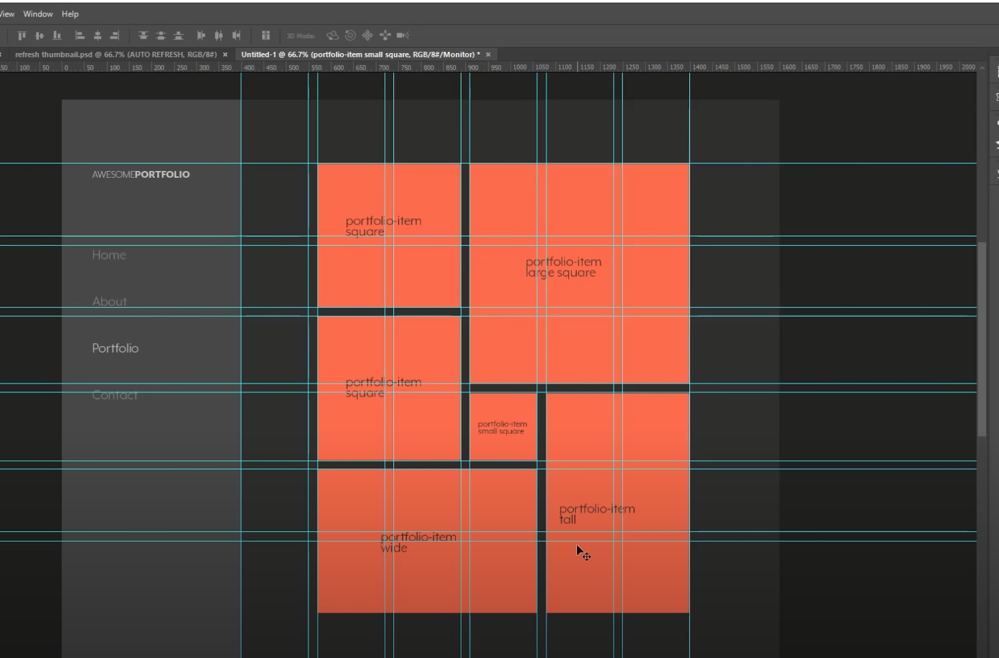
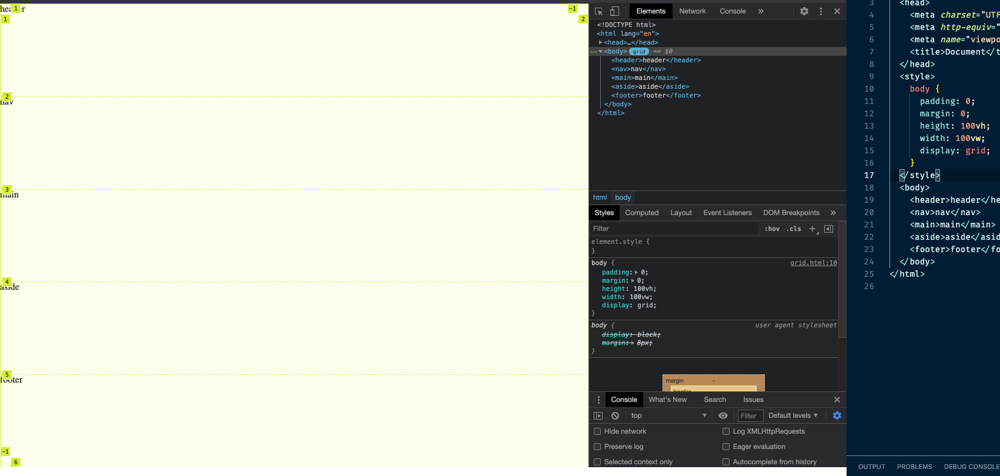
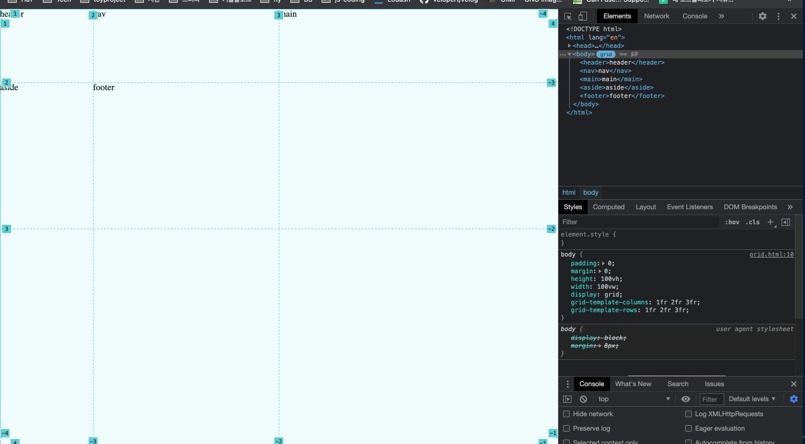
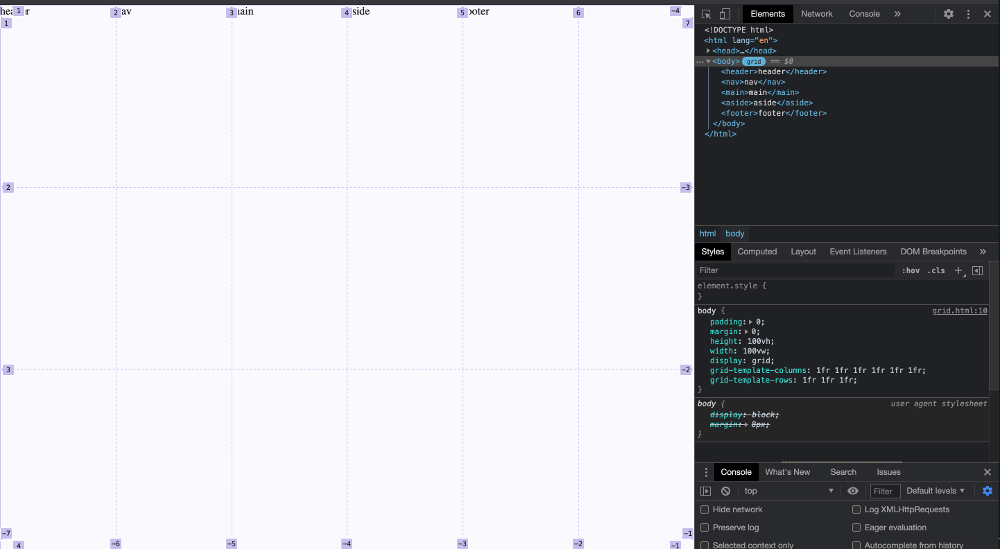
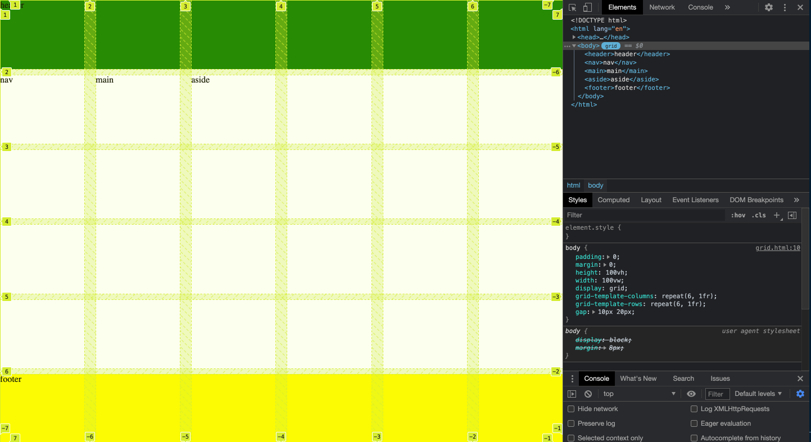
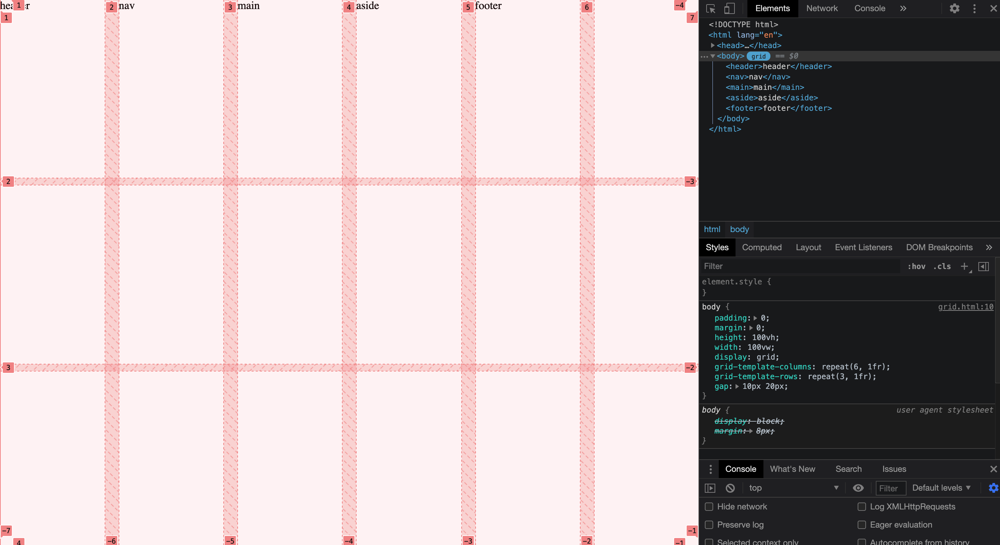
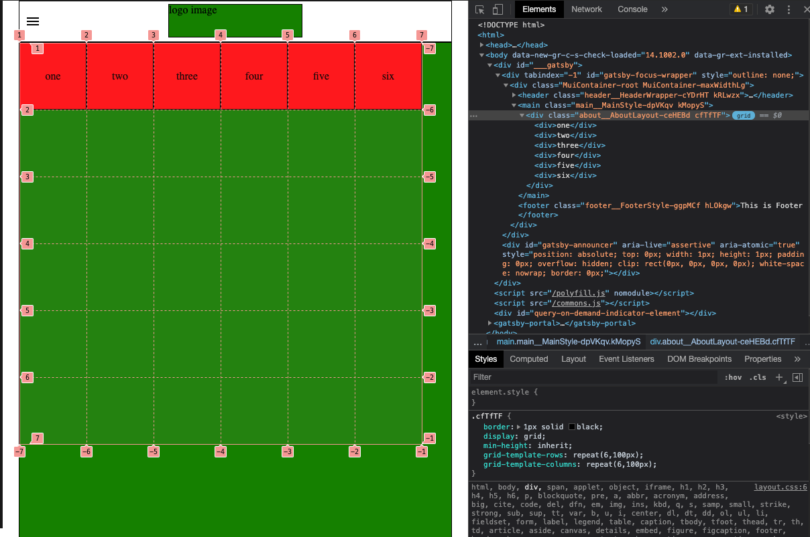
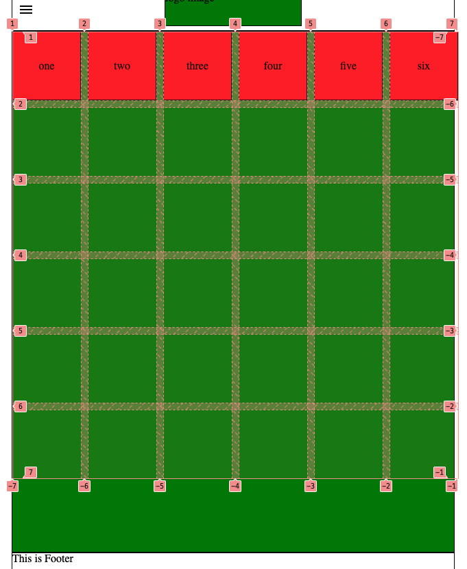
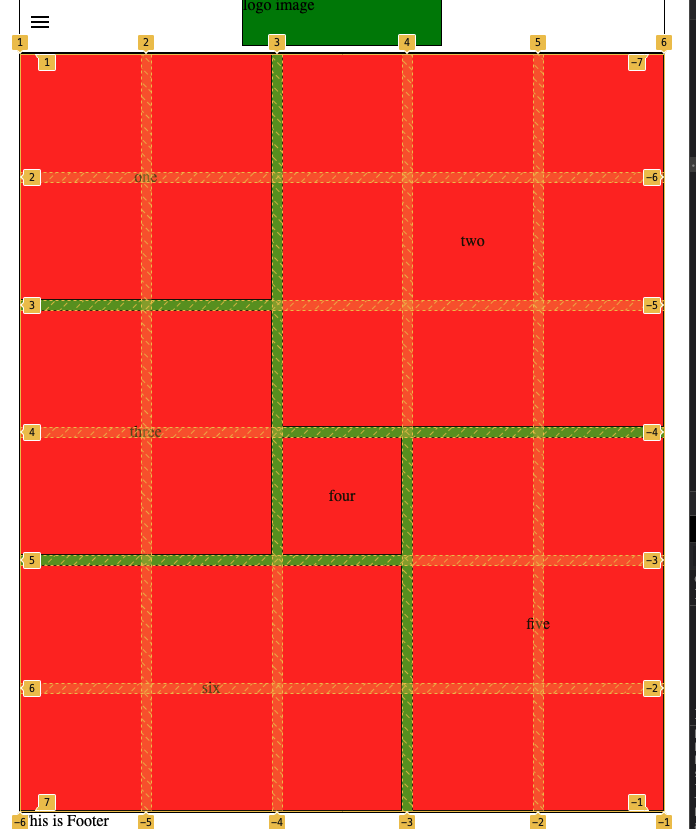

<!-- ### Grid 탄생 배경 -->

<!-- Grid를 알기전에 float, position, flexbox로 항상 Layout을 다루었는데 최근에 layout관련 작업을 할때 어려운 점이 있어서 찾다보니 Grid를 알게 되었습니다. Grid는 다뤄본 적이 없어서 왜 layout을 지정하는 방법이 발전해 온 과정을 다뤄보고자 합니다.

Grid 탄생 배경은 [Modern CSS Explained for Dinosaurs](https://medium.com/actualize-network/modern-css-explained-for-dinosaurs-5226febe3525), [floats, flexbox, grid - the progression of CSS layouts](https://www.youtube.com/watch?v=R7gqJkdc5dM&ab_channel=KevinPowell), [Why CSS grid-area is the best property for laying out content](https://www.youtube.com/watch?v=duH4DLq5yoo&ab_channel=KevinPowell) 를 보고 정리 했습니다.

- 제일 처음 사용했던 float 방식
- 그다음에 등장한 flex

- 이제는 Grid -->

### Learning materials

- css grid garden: https://cssgridgarden.com/#ko
- [CSS Grid 완벽 가이드](https://heropy.blog/2019/08/17/css-grid/)

### [CSS Grid 완벽 가이드](https://heropy.blog/2019/08/17/css-grid/) 랑 [Kevin Powell's lecture](https://www.youtube.com/watch?v=plRcoRqLriw&list=PL4-IK0AVhVjPv5tfS82UF_iQgFp4Bl998&ab_channel=KevinPowell)를 듣고 중요하다고 생각한 속성 정리

- 만들 수 있는 것:

  

- 사용한 속성

  - display: grid;
    - grid를 적용할 대상에 적용. 이크기에 맞춰서 grid가 생긴다. 그리고 자식요소들은 Grid Items가 된다
    - body에 grid 속성을 줄수도 있다.

  ```html
  <style>
    body {
      padding: 0;
      margin: 0;
      height: 100vh;
      width: 100vw;
      display: grid;
      grid-template-columns: 1fr 2fr 3fr;
      grid-template-rows: 1fr 2fr 3fr;
    }
  </style>
  <body>
    <header>header</header>
    <nav>nav</nav>
    <main>main</main>
    <aside>aside</aside>
    <footer>footer</footer>
  </body>
  ```

    

  - grid-template:

    - grid-template-columns:
      - 명시적으로 열의 크기를 정한다. `grid-template-columns: 1열의 크기 2열의 크기 ...` 이다.
    - grid-template-rows:
      - 명시적으로 행의 크기를 정한다. `grid-template-rows: 1행의 크기 2행의 크기 ...`

    

    - fr: 사용가능한 공간에 대한 비율

    - repeat: 행/열의 크기 정의를 반복

      - 없다면?
        

        이렇게 표현하기 위해서 아래와같이 반복해서 적어야한다.

        ```css
        grid-template-columns: 1fr 1fr 1fr 1fr 1fr 1fr;
        grid-template-rows: 1fr 1fr 1fr;
        ```

      - repeat을 활용하면 아래와같이 간단해진다.
        ```css
        grid-template-columns: repeat(6, 1fr);
        grid-template-rows: repeat(3, 1fr);
        ```

  - grid-column / grid-row

    - `grid-template-*` 이것들은 grid 적용하는 container에 적용하는 것이고 grid-column과 grid-row는 grid-item에 적용해서 위치를 지정할 수 있다.
    - header와 footer에 grid를 적용해서 바닥에 바로 딱 붙일 수 있다

    

    ```css
    header {
      background-color: green;
      grid-column: 1 / -1;
      grid-row: 1 / 2;
    }

    footer {
      background-color: yellow;
      grid-column: 1 / -1;
      grid-row: -2 / -1;
    }
    ```

    - 동일하게 nav, main, aside에도 적용할 수 있다.

    ```css
    nav {
      background-color: burlywood;
      grid-row: span 3;
    }

    main {
      background-color: red;
      grid-column: 2 / -2;
      grid-row: 2 / -2;
    }

    aside {
      background-color: goldenrod;
      grid-row: span 2;
    }
    ```

    span은 어디까지 될지 grid 번호를 지정하는 것이 아니라 몇개를 쓸지 지정하는거라 편한점이 있다.

  - grid-gap

    - grid-item간의 gap을 지정할 수 있다.

      

      ```css
      /* 행사이 간격, 열사이 간격 */
      gap: 10px 20px;
      ```

<!--

### Appyling Grid system based on [Kevin Powell's lecture](https://www.youtube.com/watch?v=plRcoRqLriw&list=PL4-IK0AVhVjPv5tfS82UF_iQgFp4Bl998&ab_channel=KevinPowell)

- our goal
  
- step 1: grid-template-rows and grid-template-columns
  
- step 2: grid-gap
  

```css
// repeat rows 6 times and each one is 100 px
grid-template-rows: repeat(6, 100px);

// repeat columns 6 times and each one is 100 px
grid-template-columns: repeat(6, 100px);

// putting gap beteween rows and columns
grid-gap: 10px;
```

- step 3: one [fraction](https://css-tricks.com/introduction-fr-css-unit/)
  

- step4:
  

````css
& > div.medium {
    grid-row: span 2;
    grid-column: span 2;
}

& > div.large {
    grid-row: span 3;
    grid-column: span 3;
}

& > div.small {
    grid-row: span 1;
    grid-column: span 1;
}

& > div.tall {
    grid-row: 4 / span 3;
    grid-column: 4 / span 2;

}

& > div.wide {
grid-row: span 2;
grid-column: span 3;
}

```-->

### References

- [floats, flexbox, grid - the progression of CSS layouts](https://www.youtube.com/watch?v=R7gqJkdc5dM&ab_channel=KevinPowell)
- [Modern CSS Explained for Dinosaurs](https://medium.com/actualize-network/modern-css-explained-for-dinosaurs-5226febe3525)
- [Why CSS grid-area is the best property for laying out content](https://www.youtube.com/watch?v=duH4DLq5yoo&ab_channel=KevinPowell)
- [CSS Grid: One Layout, Multiple Ways](https://css-tricks.com/css-grid-one-layout-multiple-ways/)
- [CSS Grid 완벽 가이드](https://heropy.blog/2019/08/17/css-grid/)
- [Build a Mosaic Portfolio Layout with CSS Grid](https://www.youtube.com/watch?v=plRcoRqLriw&list=PL4-IK0AVhVjPv5tfS82UF_iQgFp4Bl998&ab_channel=KevinPowell)
- [An Introduction to the `fr` CSS unit](https://css-tricks.com/introduction-fr-css-unit/)
